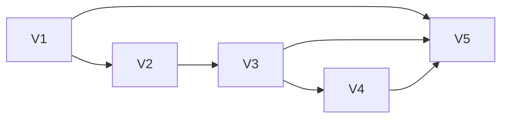

# Global agent setup — Slices

Shape D: top-level `mcptools agent setup|status|uninstall
--target codex|claude|pi|opencode2|all --dry-run`.
Ground truth for slice definitions, DAG, per-slice affordances, interfaces, demos.

Pattern policy: `~/.claude/patterns/POLICY.md`
(MUST Functional Core - Imperative Shell; SHOULD the rest when applicable).

## Slice summary

| # | Slice | Mechanism | Depends on | Demo |
| --- | ----- | --------- | ---------- | ---- |
| V1 | Doctor reads, no writes | A2 | | `agent status --target all` prints per-target health, `pi` shows `MissingAgent` |
| V2 | Setup dry-run plans, writes nothing | A3, A4 | V1 | `agent setup --target claude --dry-run` prints paths plus changes, filesystem untouched |
| V3 | JSON write, atomic, refuse, rerun no-op | A4, A6 | V2 | Temp-HOME setup writes `mcptools` entry, rerun no-ops, edited entry refuses, backup exists |
| V4 | Skills plus uninstall | A5, A7 | V3 | Setup installs skill dir, uninstall removes owned-unchanged, edited skill kept with warning |
| V5 | Codex adapter plus all-matrix | A1 | V1, V3, V4 | Temp HOME with space in path, `setup --target all` wires every target, status honest on missing `pi` |

DAG batches: [V1] → [V2] → [V3] → [V4] → [V5].
V5 edges: V1 (wiring N7→N9), V3 and V4 (shared executor files).

## V1: Doctor reads, no writes

| # | Component | Affordance | Control | Wires Out | Returns To |
| --- | --------- | ---------- | ------- | --------- | ---------- |
| U2 | agent cli | `agent status --target` | type | → N1 | — |
| U6 | agent cli | doctor report, per-target health | render | — | — |
| N1 | agent cli | parse args to `Target` plus `Action` ADT | call | → N2 | — |
| N2 | shell | gather `GlobalFacts`, exe probe, file reads, version probes, writability | call | → N8 | — |
| N8 | core health | classify `Health` ADT | call | → N9 | → U6 |
| N9 | core format | format doctor text, no secrets | call | — | → U6 |

Demo: `HOME=/tmp/t1 mcptools agent status --target all` exits 0, prints one
line per target including `pi: MissingAgent (executable not found)`, writes no files.
Register `Agent` subcommand in `crates/mcptools/src/main.rs` `SubCommands`
beside `Atlas`. Never require a git repo: global mode bypasses `find_git_root`.

**Interfaces:**
- Produces: `crates/core/src/agent/health.rs dyejhp` — `pub enum AgentTarget { Codex, Claude, Pi, Opencode, All }`, `pub enum AgentAction { Setup, Status, Uninstall }`, `pub enum Health { MissingBinary, ObsoleteBinary, MissingAgent, UnsupportedVersion, UnwritableConfig, Live }`, `pub struct GlobalFacts { exe: Option<PathBuf>, exe_version: Option<String>, targets: Vec<AgentTarget> }`, `pub struct TargetHealth { target: AgentTarget, health: Health, detail: String }`, `pub fn classify_health(facts: &GlobalFacts) -> Vec<TargetHealth>`
- Produces: `crates/mcptools/src/agent/cli.rs dyejhp` — `pub fn gather_global_facts(target: AgentTarget) -> Result<GlobalFacts>`, `pub fn format_doctor(health: &[TargetHealth]) -> String`

## V2: Setup dry-run plans, writes nothing

| # | Component | Affordance | Control | Wires Out | Returns To |
| --- | --------- | ---------- | ------- | --------- | ---------- |
| U1 | agent cli | `agent setup --target --dry-run` | type | → N1 | — |
| U4 | agent cli | plan output, paths plus changes | render | — | — |
| N3 | core planner | `plan_global`, pure, returns `GlobalAction[]` | call | → N4, → N5 | — |
| N4 | core merge | decide merge, skip, or refuse on owned `mcptools` key | call | — | → N3 |
| N5 | core stage | decide skill file writes from bundled source | call | — | → N3 |
| N9 | core format | format plan text | call | — | → U4 |

Demo: `HOME=/tmp/t2 mcptools agent setup --target claude --dry-run` prints
`create ~/.claude.json mcpServers.mcptools` or `already installed`,
`find /tmp/t2 -newer /tmp/t2.marker` returns nothing.
Unit-test every pure planner: merge, skip-identical, refuse-different, all targets.

**Interfaces:**
- Consumes: `GlobalFacts`, `AgentTarget`, `AgentAction` (from V1)
- Produces: `crates/core/src/agent/plan.rs` — `pub enum GlobalAction { Create { path: PathBuf, content: Vec<u8> }, MergeOwned { path: PathBuf, content: Vec<u8> }, Skip { path: PathBuf, reason: SkipReason }, Refuse { path: PathBuf, diff: String }, RemoveOwned { path: PathBuf } }`, `pub fn plan_global(facts: &GlobalFacts, action: AgentAction) -> Vec<GlobalAction>`, `pub fn format_plan(actions: &[GlobalAction]) -> String`

## V3: JSON write, atomic, refuse, rerun no-op

| # | Component | Affordance | Control | Wires Out | Returns To |
| --- | --------- | ---------- | ------- | --------- | ---------- |
| U5 | agent cli | summary output, executed actions | render | — | — |
| U7 | agent cli | conflict report, refused path plus diff | render | — | — |
| U8 | agent cli | rollback info, backup path plus restore | render | — | — |
| U9 | home configs | written MCP entries, `~/.claude.json`, `opencode.json` | perceive | — | — |
| N4 | core merge | full decision with byte compare | call | → N6 | → N3 |
| N6 | shell | atomic write, tmp plus rename, backup `<file>.mcptools-backup.<ts>` | write | S1, S2 | → N9 |
| N9 | core format | format summary, conflict, rollback text | call | — | → U5, → U7, → U8 |

Demo: `HOME=/tmp/t3 mcptools agent setup --target claude` writes entry;
rerun prints `already installed` and changes no mtime; hand-edit owned value
then setup prints `refused` and file bytes identical;
`<file>.mcptools-backup.*` exists after overwrite.
Temp-HOME tests plus paths with spaces mandatory. No secret bytes in output.

**Interfaces:**
- Consumes: `plan_global`, `GlobalAction` (from V2)
- Produces: `crates/mcptools/src/agent/exec.rs` — `pub struct BackupInfo { backup_path: Option<PathBuf>, restore_cmd: String }`, `pub fn atomic_write(path: &Path, content: &[u8]) -> Result<BackupInfo>`, `pub fn execute_global(actions: &[GlobalAction]) -> Result<Vec<BackupInfo>>`

## V4: Skills plus uninstall

| # | Component | Affordance | Control | Wires Out | Returns To |
| --- | --------- | ---------- | ------- | --------- | ---------- |
| U3 | agent cli | `agent uninstall --target --dry-run` | type | → N1 | — |
| U9 | home configs | skill dirs, `~/.claude/skills/mcptools/`, `~/.agents/skills/mcptools/` | perceive | — | — |
| N5 | core stage | full skill stage plus uninstall decision, owned-unchanged only | call | → N6 | → N3 |
| N9 | core format | format uninstall summary plus user-edited warnings | call | — | → U5 |

Demo: `HOME=/tmp/t4 mcptools agent setup --target claude` creates `SKILL.md`;
`agent uninstall --target claude` removes dir; re-setup then hand-edit
`SKILL.md` then uninstall prints `user-edited, left unchanged` and file stays.
Uninstall never touches foreign keys, foreign skill dirs, or edited owned entries.

**Interfaces:**
- Consumes: `atomic_write`, `execute_global` (from V3); `GlobalAction` (from V2)
- Produces: `crates/core/src/agent/plan.rs` — `pub fn plan_uninstall(facts: &GlobalFacts) -> Vec<GlobalAction>`, `pub fn stage_skill(template: &str) -> String`

## V5: Codex adapter plus all-matrix

| # | Component | Affordance | Control | Wires Out | Returns To |
| --- | --------- | ---------- | ------- | --------- | ---------- |
| U1 | agent cli | `agent setup --target all` | type | → N1 | — |
| N7 | shell | `codex mcp add/remove`, no TOML hand-edit | call | S1 | → N9 |

Demo: `HOME="/tmp/t 5" mcptools agent setup --target all` exits 0,
`pi` skill dir exists, status shows `pi: MissingAgent` while JSON targets show
`Live`, `grep -r "$LINEAR_API_KEY" "/tmp/t 5"` finds nothing.
Pi needs skill only, never MCP bridge. Record agent version floors found live,
or presence-check default.

**Interfaces:**
- Consumes: `format_doctor` (from V1); `atomic_write`, `execute_global` (from V3); `plan_uninstall`, `stage_skill` (from V4)
- Produces: `crates/mcptools/src/agent/codex.rs` — `pub fn codex_mcp_add(name: &str, command: &str, args: &[String]) -> Result<()>`, `pub fn codex_mcp_remove(name: &str) -> Result<()>`
