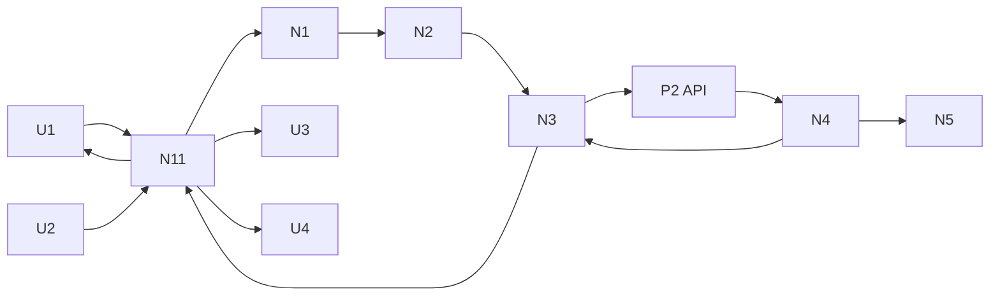

# LINEAR-01 — Slices

Shape A breadboarded for implementation. Operator is a noninteractive CLI
invoker or script. Every slice ends in operator-observable output: CLI JSON or
table on stdout, or diagnostics on stderr with a nonzero exit.

## Places

| # | Place | Description |
|---|-------|-------------|
| P1 | CLI run (noninteractive) | `mcptools linear` invoke, stdout/stderr, exit code |
| P2 | Linear API | `https://api.linear.app/graphql` |

## Operator Affordances

| # | Place | Component | Affordance | Control | Wires Out | Returns To |
|---|-------|-----------|------------|---------|-----------|------------|
| U1 | P1 | linear cli | `auth status [--json]` output | invoke | → N11 | — |
| U2 | P1 | linear cli | `issue get <id> [--json]` output | invoke | → N11 | — |
| U3 | P1 | linear cli | human table render | render | — | — |
| U4 | P1 | linear cli | stderr diagnostic plus nonzero exit | render | — | — |

## Code Affordances

| # | Place | Component | Affordance | Control | Wires Out | Returns To |
|---|-------|-----------|------------|---------|-----------|------------|
| N1 | P1 | core::linear | `LinearConfig::from_env()` parse plus redact | call | → N2 | → N11 |
| N2 | P1 | shell::linear | `build_client(timeout=10s)` | call | → N3 | → N3 |
| N3 | P1 | shell::linear | `execute(query,variables)` | call | → P2, → N4 | → N11 |
| N4 | P1 | core::linear | `check_response(status,body)` HTTP to JSON to `errors[]` to `data` to `success` | call | → N5 | → N3 |
| N5 | P1 | core::linear | `classify_retry(status,code,headers)` plus `retry_after_ms()` | call | — | → N3 |
| N6 | P1 | core::linear | `Viewer`, `IssueMini{id,identifier,title,url,state}`, `PageInfo{has_next,end_cursor}` types plus transforms | call | — | → N11 |
| N7 | P1 | shell::linear | viewer GraphQL doc `{viewer{id name email}}` | call | → N3 | → N6 |
| N8 | P1 | shell::linear | issue GraphQL doc by id/identifier plus variables | call | → N3 | → N6 |
| N9 | P1 | shell::linear | bounded read retry, max 3, backoff plus jitter, honor both reset headers | call | → N3 | → N3 |
| N10 | P1 | shell::linear | uncertain-mutation guard (no blind retry, reconciliation hint) | call | — | → N4 |
| N11 | P1 | linear cli | clap dispatch `linear auth status`, `linear issue get`, JSON vs table, stdout/stderr split | call | → N1, → N7, → N8 | → U1, → U2, → U3, → U4 |

No data stores. Raw cursor pagination; no filesystem token store.

## Slice Summary

| # | Slice | Mechanism | Depends on | Demo |
|---|-------|-----------|------------|------|
| V1 | Auth status vertical | A1, A2, A3, A4 | | `mcptools linear auth status --json` prints viewer identity; bad key prints diagnostic to stderr with nonzero exit |
| V2 | Retry/rate/error hardening | A5, A6, A7 | V1 | Forced 400 validation plus offline `cargo test -p mcptools_core linear` green; rate path reports retry hint, writes never retried |
| V3 | Minimal issue read proof | A8 plus proof read | V2 | `mcptools linear issue get GUZ-79 --json` prints id, identifier, title, url, state |

Serial DAG by shared files `crates/core/src/linear/*` and
`crates/mcptools/src/linear/*`. Parallel batches: [V1] → [V2] → [V3].

## V1: Auth status vertical

| # | Component | Affordance | Control | Wires Out | Returns To |
|---|-----------|------------|---------|-----------|------------|
| U1 | linear cli | `auth status [--json]` output | invoke | → N11 | — |
| U3 | linear cli | human table render | render | — | — |
| U4 | linear cli | stderr diagnostic plus nonzero exit | render | — | — |
| N1 | core::linear | `LinearConfig::from_env()` parse plus redact | call | → N2 | → N11 |
| N2 | shell::linear | `build_client(timeout=10s)` | call | → N3 | → N3 |
| N3 | shell::linear | `execute(query,variables)` minimal: variables only, checks HTTP status plus `errors[]` plus `data` presence | call | → P2, → N4 | → N11 |
| N4 | core::linear | `check_response(status,body)` minimal: HTTP, JSON parse, `errors[]`, `data` | call | — | → N3 |
| N6 | core::linear | `Viewer{id,name,email}` type plus transform | call | — | → N11 |
| N7 | shell::linear | viewer GraphQL doc `{viewer{id name email}}` | call | → N3 | → N6 |
| N11 | linear cli | clap dispatch `linear auth status`, JSON vs table, stdout/stderr split | call | → N1, → N7 | → U1, → U3, → U4 |

**Interfaces:**

- Produces: `LinearConfig::from_env() -> Result<LinearConfig, color_eyre::eyre::Report>` in `crates/mcptools/src/linear/config.rs`. Reads `LINEAR_API_KEY` at runtime only. Missing key returns actionable error naming the variable. Never logs or prints the key.
- Produces: `build_client(cfg: &LinearConfig) -> Result<reqwest::Client, color_eyre::eyre::Report>` with 10s request timeout.
- Produces: `execute(client: &reqwest::Client, query: &str, variables: serde_json::Value) -> Result<serde_json::Value, color_eyre::eyre::Report>` in `crates/mcptools/src/linear/client.rs`. Sends GraphQL variables only, never string-interpolated queries. Rejects non-object variables before I/O. Treats HTTP errors, unparsable JSON, present `errors[]`, and absent `data` as errors.
- Produces: `auth_status_data(client: &reqwest::Client) -> Result<Viewer, color_eyre::eyre::Report>` with `Viewer { id: String, name: String, email: Option<String> }` in `crates/core/src/linear/types.rs`.
- Produces: CLI `mcptools linear auth status [--json]` wired in `crates/mcptools/src/main.rs` `SubCommands` plus `crates/mcptools/src/linear/mod.rs` dispatch. `--json` prints the bare viewer struct to stdout. Without the flag prints a human table to stdout. All diagnostics go to stderr via `eprintln`. Failure exits nonzero with no stdout payload.

Demo: `LINEAR_API_KEY=$KEY cargo run -q -p mcptools -- linear auth status --json`
prints `{"id":"...","name":"...","email":"..."}` on stdout. Then
`LINEAR_API_KEY=bad cargo run -q -p mcptools -- linear auth status; echo $?`
prints a diagnostic naming authentication failure to stderr and exits nonzero.
`cargo test -p mcptools_core linear` passes for the new viewer transform and
missing-auth redaction fixtures.

## V2: Retry/rate/error hardening

| # | Component | Affordance | Control | Wires Out | Returns To |
|---|-----------|------------|---------|-----------|------------|
| U4 | linear cli | stderr diagnostic plus nonzero exit | render | — | — |
| N4 | core::linear | `check_response` full: partial `data+errors` is error, mutation `success` flag check | call | → N5 | → N3 |
| N5 | core::linear | `classify_retry(status,code,headers)` plus `retry_after_ms()` | call | — | → N3 |
| N9 | shell::linear | bounded read retry, max 3, backoff plus jitter, honor both reset headers | call | → N3 | → N3 |
| N10 | shell::linear | uncertain-mutation guard (no blind retry, reconciliation hint) | call | — | → N4 |

**Interfaces:**

- Consumes: `execute()` from V1 (extends its check pipeline and adds the retry loop in the same file).
- Produces: `classify_retry(status: u16, code: &str, headers: &reqwest::header::HeaderMap) -> Option<u64>` in `crates/core/src/linear/retry.rs`, returning retry-after milliseconds. Detects HTTP 429, GraphQL `RATELIMITED` code, and HTTP 400 rate responses. Prefers `Retry-After` when present, else the earlier of `x-ratelimit-requests-reset` and `x-ratelimit-complexity-reset` (epoch millis), else a small default backoff.
- Produces: read-only retry inside `execute()`: at most 3 attempts total for queries, exponential backoff with jitter between attempts. Mutations and timeout-uncertain transport outcomes are never retried; instead `execute()` returns an error whose message states the uncertainty and names the reconciliation path (re-query by ID before deciding to resend).
- Produces: offline tests in `crates/core/src/linear/` plus shell mock-HTTP tests covering missing auth, key redaction (assert the key string never appears in any `Debug` or error output), request timeout, malformed JSON body, HTTP 200 with `errors[]`, partial `data+errors`, 429 with reset header, `RATELIMITED` code, and exhausted retries. No test hits the network.

Demo: `cargo test -p mcptools_core linear` is fully green including the new
retry, partial-error, and redaction cases. A live forced-validation call (for
example an intentionally unknown viewer field in a scratch request, never
committed) returns HTTP 400 diagnostics to stderr with a nonzero exit and no
stdout payload. No mutation is sent during this demo.

## V3: Minimal issue read proof

| # | Component | Affordance | Control | Wires Out | Returns To |
|---|-----------|------------|---------|-----------|------------|
| U2 | linear cli | `issue get <id> [--json]` output | invoke | → N11 | — |
| N6 | core::linear | `IssueMini{id,identifier,title,url,state}` plus `PageInfo{has_next,end_cursor}` types plus transforms | call | — | → N11 |
| N8 | shell::linear | issue GraphQL doc by id/identifier plus variables | call | → N3 | → N6 |
| N11 | linear cli | clap dispatch `linear issue get`, JSON vs table | call | → N8 | → U2, → U3, → U4 |

**Interfaces:**

- Consumes: `execute()`, `build_client()`, `LinearConfig` from V1; retry and check pipeline from V2.
- Produces: `issue_get_data(client: &reqwest::Client, id_or_identifier: &str) -> Result<IssueMini, color_eyre::eyre::Report>` in `crates/mcptools/src/linear/issue.rs`. Validates the selector is nonempty before I/O and sends it as a GraphQL variable. `IssueMini { id: String, identifier: String, title: String, url: String, state: String }` lives in `crates/core/src/linear/types.rs`. `PageInfo { has_next: bool, end_cursor: Option<String> }` is defined for future LINEAR-03 reuse but this command returns a single issue and no cursor.
- Produces: CLI `mcptools linear issue get <ID> [--json]` following the V1 dispatch pattern. `--json` prints the bare issue struct to stdout, human table otherwise, errors to stderr with nonzero exit.

Demo: `LINEAR_API_KEY=$KEY cargo run -q -p mcptools -- linear issue get GUZ-79 --json`
prints `{"id":"...","identifier":"GUZ-79","title":"...","url":"https://linear.app/...","state":"..."}`
on stdout. Unknown identifiers print a not-found diagnostic to stderr and exit
nonzero.
